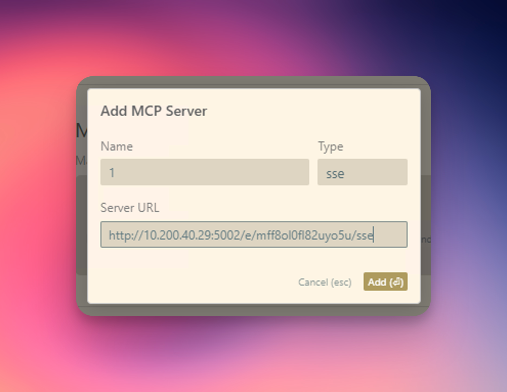
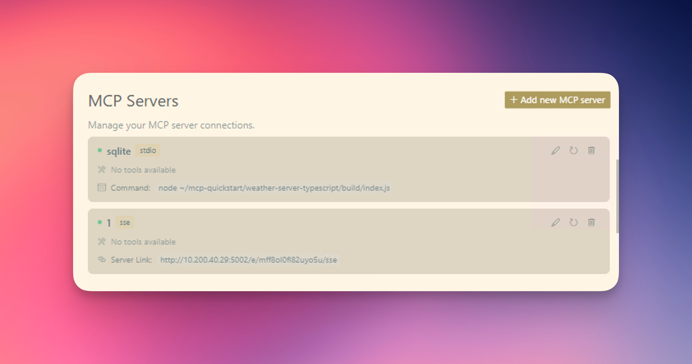

# MCP Server

[](https://github.com/hjlarry/dify-plugin-mcp_server)
[](https://github.com/hjlarry/dify-plugin-mcp_server)

A Dify endpoint plugin that change a dify app to a mcp server.

## Get Started

### 1. create a simple workflow app in dify.


### 2. add a endpoint and select this app.


the app input schema should describe the input parameters of the app, the format like this:
```json
{
    "name": "get_weather",
    "description": "Get weather status for a place.",
    "inputSchema": {
        "properties": {
            "place": {"title": "Place", "type": "string"}
        },
        "required": ["place"],
        "title": "get_weatherArguments",
        "type": "object"
    }
}
```

### 3. copy the endpoint url to your mcp client, like `cursor`


### 4. enjoy it!

